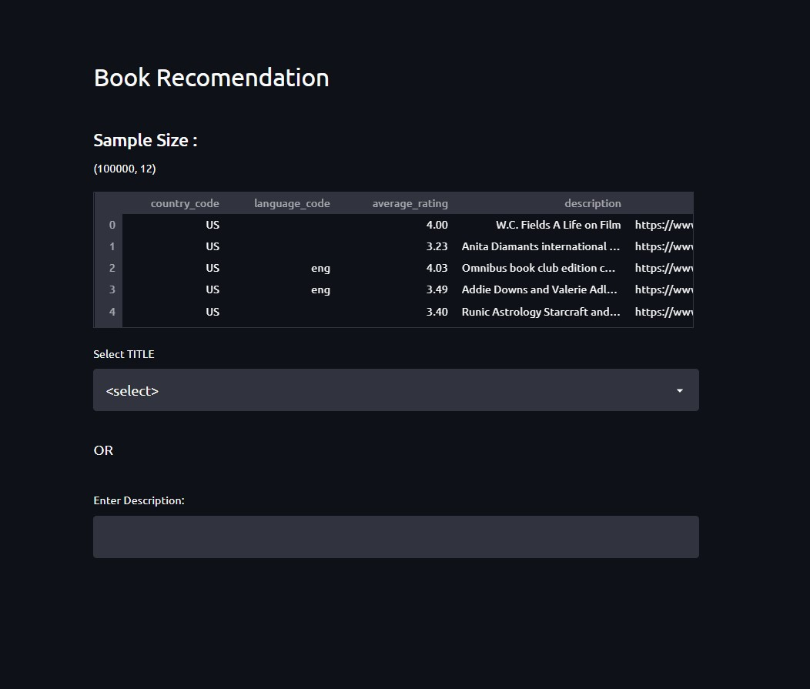
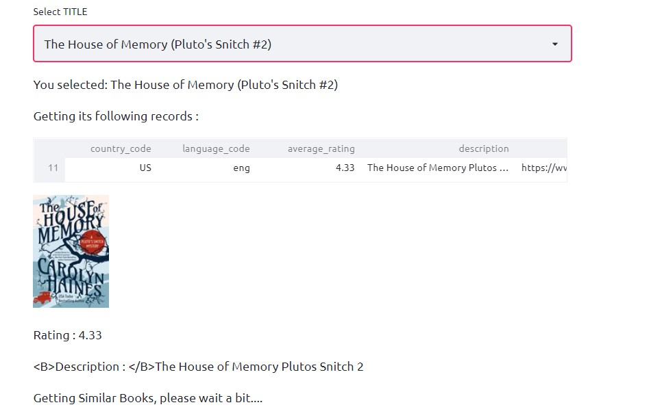
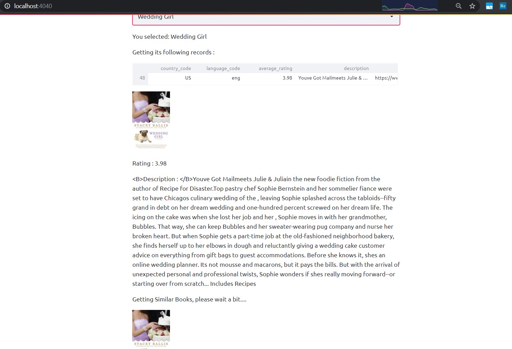
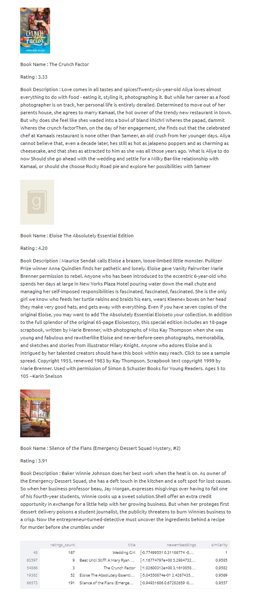
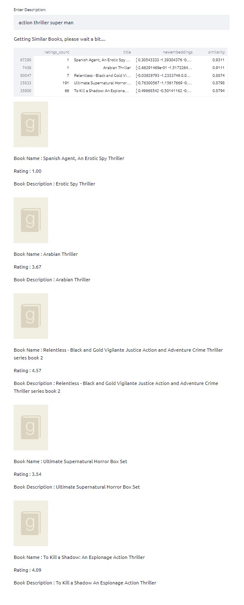
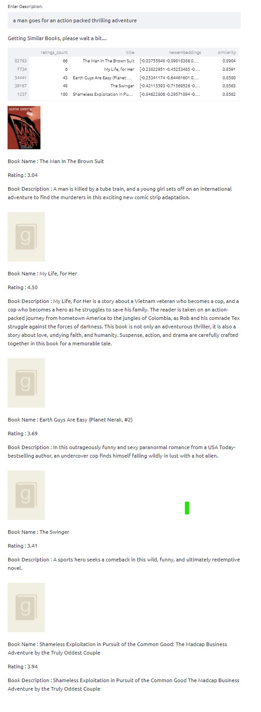

# BookReads-Recommendation

This is a project for goodReads - Book Recommendation System
### Directory Structure : 
1. images - contains static images
2. SRC - final source code of models and deployment scripts
3. SRC/pipeline2 - BERT sentence embeddings model
4. test - all testing ipynb notebooks (includes model building and other testing and cleaning of data)          

download embeddings.pkl from [here](https://drive.google.com/file/d/1cvZbzBWdsTLGrS-RiYjoi2u_o44PMWNT/view?usp=sharing) and place it in "SRC/pipeline2"

## ScreenShots

1. Recommendation of books from a sample size

2. Select Book

3. Getting Similar Books

4. Describe your genre/type of book you want in description box

